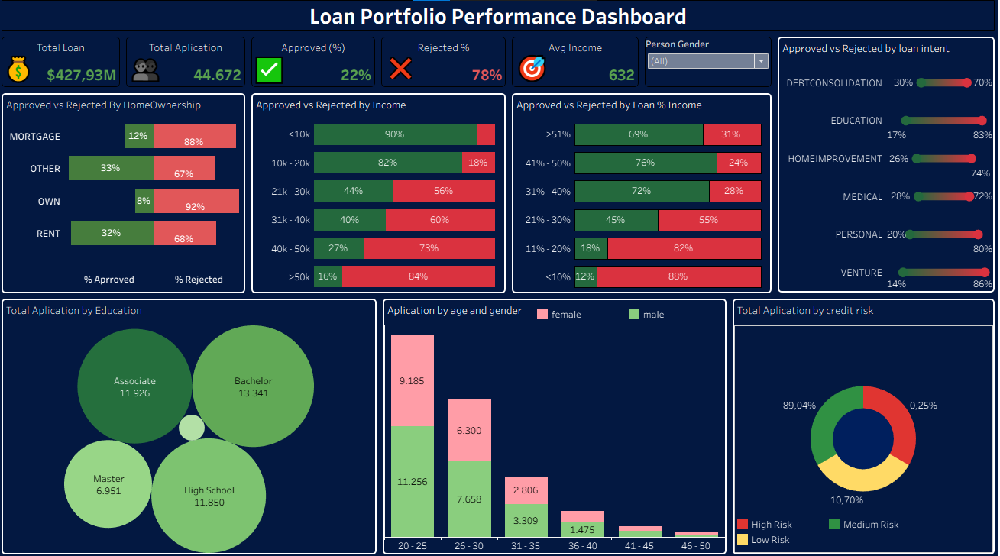
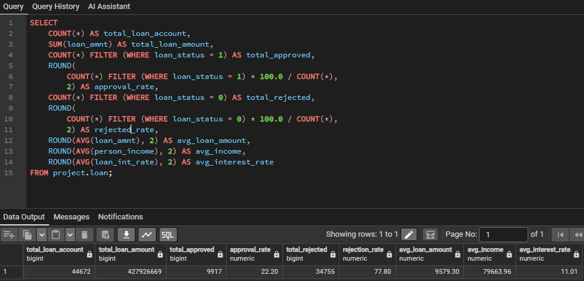
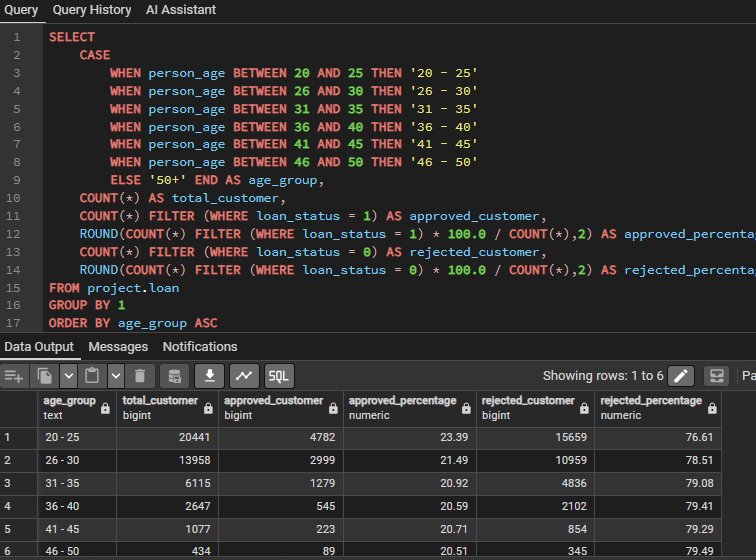
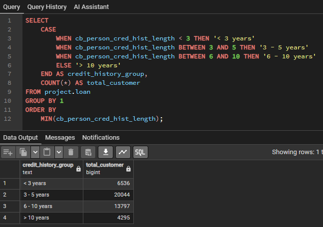
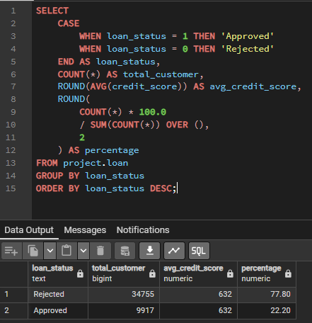
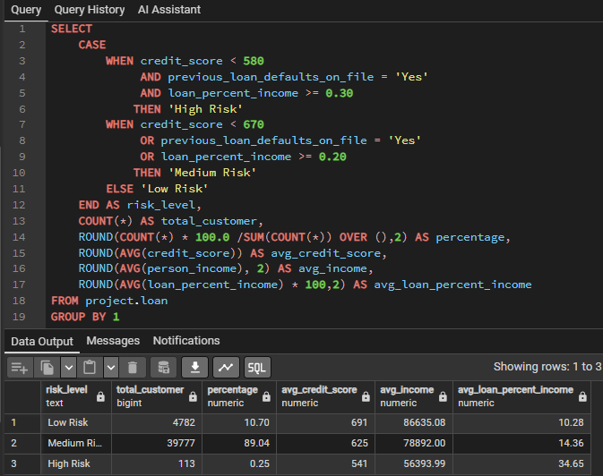

# Loan Portfolio Analysis

An end-to-end Loan Portfolio Analysis project using **SQL and Tableau** to analyze loan performance, customer characteristics, approval decisions, and credit risk.

## 📌 Project Overview

This project analyzes **44,672 loan applications** with a total loan value of **$427.93M**.
The analysis focuses on understanding loan portfolio performance, customer profiles, approval patterns, and factors associated with credit risk.

## 🎯 BUSINESS QUESTIONS
1. How is the overall loan portfolio performing?
2. What are the characteristics of customers who apply for loans the most?
3. What characteristics differentiate approved and rejected applicants?
4. What type of customer has the highest credit risk?
5. How can the company improve loan approval decisions and reduce credit risk?

## 🛠️ Tools Used

- SQL     – Data cleaning and analysis
- Tableau – Data visualization and dashboard
- CSV     – Dataset
- GitHub  – Project documentation

## 📂 Dataset

  

**File:** [`loan-dataset.csv`](dataset/loan-dataset.csv)

**Dataset Overview**

| Information     | Value          |
|-----------------|-------         |
| Records         | **44,672**     |
| Features        | **14 Columns** |
| Target Variable | `loan_status`  |
| Format          | CSV            |

## 📊 Dashboard

## Query 

## Images
1. KPI Loan

2. Age Group

3. History

4. Credit Score

5. Risk Level

## 💡 Business Insights

1. The loan portfolio is substantial, totaling $427.93M across 44,672 applications. However, the lending strategy appears highly conservative, with a 78% rejection rate compared to only 22% approved applications.

2. The applicant base is primarily composed of young adults aged 20–30 years, with most applicants holding a Bachelor's degree or High School diploma.

3. Applicants with annual income above $50K and home ownership status of OWN experienced the highest rejection rates (84% and 92%, respectively). In contrast, loans for Medical and Home Improvement purposes showed relatively higher approval rates.

4. The portfolio is heavily concentrated in the Medium Risk category, representing 89.04% of all loan applications, indicating that most applicants fall into a moderate credit risk segment.

## 💼 Business Recommendations

1. Reassess underwriting criteria that appear overly restrictive for high-income applicants and customers with OWN home ownership status to avoid rejecting potentially creditworthy borrowers and losing valuable market opportunities.
  
2. Continue focusing on the 20–30 age group, which represents the largest applicant segment, while improving behavior-based credit scoring to enhance approval accuracy and risk assessment.

3. Reduce exposure to high-risk loan purposes, such as Venture loans, and prioritize lending in more stable sectors like Medical and Education to improve overall portfolio quality.

